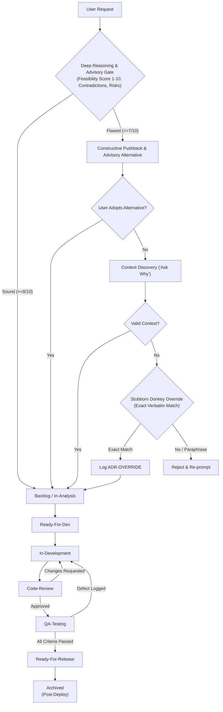
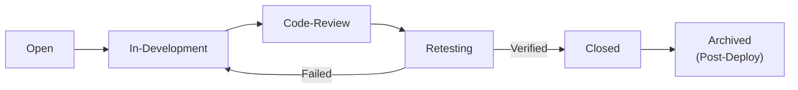

# Canonical Reference: Contracts, Lifecycle & Quality Gates

This document is the single source of truth for task statuses, defect severities, transition authorities, branch naming, path contracts, and quality gates across the IT Department skill.

---

## 1. Canonical State Machine

### 1.1 Feature Task Lifecycle & Intake Advisory Gate
Every feature request begins with critical feasibility evaluation before task creation. The IT department is **not a blind doer**; it acts as a Deep Reasoner and Strategic Technical Advisor.



| Canonical Status | Directory Location | State Transition Trigger | Required Verification Evidence |
| :--- | :--- | :--- | :--- |
| **`Backlog`** | `<vault>/01-Tasks/Backlog/` | Product Owner / CTO | Business requirement summary, Feasibility score ($\ge 8/10$ or resolved via ADR-OVERRIDE), priority score. |
| **`In-Analysis`** | `<vault>/01-Tasks/In-Analysis/` | System Analyst / Architect | Initial state for Full-route tasks; repo inspection started; data models drafted. |
| **`Ready-For-Dev`** | `<vault>/01-Tasks/Ready-For-Dev/` | System Analyst / Tech Lead | Passes **Definition of Ready (DoR)** checklist. If advisory pushback occurred, resolved alternative or ADR-OVERRIDE confirmed. Tasks with `content_review: required` carry `content_review_intake: approved` (content review Checkpoint A). Initial state for Lightweight route. |
| **`In-Development`** | `<vault>/01-Tasks/In-Development/` | Assigned Developer | Isolated worktree created; branch checked out; `assigned_agent` set. |
| **`Code-Review`** | `<vault>/01-Tasks/Code-Review/` | Assigned Developer | Pre-deploy CI passed (lint, typecheck, unit tests); PR opened; diff ready. |
| **`QA-Testing`** | `<vault>/01-Tasks/QA-Testing/` | Reviewer / Coordinator | Peer review signed off; merged into integration branch; deployed to test env. |
| **`Ready-For-Release`** | `<vault>/01-Tasks/Ready-For-Release/` | QA Engineer | All acceptance criteria verified; zero open blocking defects (`Critical`/`Major`); pre-release content review verdict `approved` or `approved-with-deferrals` attached to the candidate SHA (content review Checkpoint B). |
| **`Archived`** | `<vault>/04-Archive/Completed-Tasks/` | DevOps / Release Coordinator | **Confirmed production deployment** with immutable commit SHA and release tag. |

### 1.2 Defect / Bug Lifecycle
Defects discovered by QA or users follow this dedicated lifecycle:



| Canonical Status | Directory Location | State Change Authority | Required Evidence |
| :--- | :--- | :--- | :--- |
| **`Open`** | `<vault>/02-Bugs/` | QA Engineer / User | Reproduction steps, environment, actual vs expected behavior, severity. |
| **`In-Development`** | `<vault>/02-Bugs/` | Assigned Developer | Worktree checked out; bug branch created. |
| **`Code-Review`** | `<vault>/02-Bugs/` | Assigned Developer | PR opened with targeted test covering the defect. |
| **`Retesting`** | `<vault>/02-Bugs/` | QA Engineer | Fix deployed to test environment; regression checks running. |
| **`Closed`** | `<vault>/02-Bugs/` | QA Engineer | Verification passed on test environment. |
| **`Archived`** | `<vault>/04-Archive/Resolved-Bugs/` | DevOps / Release Coordinator | Production deployment confirmed with release tag. |

---

## 2. Defect Severity & Release Blocking Rules

| Severity | Definition | Release Impact & Authority |
| :--- | :--- | :--- |
| **`Critical`** | Production crash, service unavailability, data corruption, or security vulnerability. | **STRICT BLOCKER.** Zero tolerance. Halts release. Cannot be deferred. |
| **`Major`** | Core business workflow failure, critical calculation error, or broken endpoint with no workaround. | **STRICT BLOCKER.** Must be resolved and re-tested before release. |
| **`Minor`** | Edge-case flaw, non-critical validation mismatch, or secondary UI defect with an available workaround. | **NON-BLOCKING WITH EXPLICIT SIGN-OFF.** May be deferred to next sprint only with explicit CTO / User approval and documented risk note. |
| **`Trivial`** | Cosmetic defect, typo, minor spacing/alignment issue. | **NON-BLOCKING.** Logged to backlog; does not require formal CTO sign-off to proceed with release. |

Content defects (wrong language or writing system, untranslated or mixed-language strings, wrong meaning, broken placeholders, truncation) use the same scale with `category: content` in the bug note; examples per level are in [`agents/content-reviewer.md`](../agents/content-reviewer.md) §5, and `content_review.block_release_on` in `config.json` lists the blocking severities.

---

## 3. Path Resolution Contract & Multi-Repo Worktrees

All path resolution is relative to `<project_root>`:
1.  **Configuration File:** `<project_root>/.it-department/config.json` (fixed discovery location).
2.  **Vault Root:** `<project_root>/${paths.vault_relative_path}` (default `vault`).
3.  **Sessions Directory:** `<project_root>/${paths.sessions_relative_path}` (default `.it-department/sessions`).
4.  **Worktrees Directory:** `<project_root>/${paths.worktrees_relative_path}` (default `.it-department/worktrees`).
5.  **Usage Ledger:** `<project_root>/${efficiency.ledger_path}` (default `.it-department/sessions/_usage/ledger`), aggregates only, versioned; `_usage/raw/` and `_usage/audit-runs/` are git-ignored.
6.  **Machine-Time Feed (optional):** `<project_root>/${efficiency.jobs_log_path}` (default `.it-department/jobs`): job logs or `jobs.jsonl`.
7.  **Usage Audit Reports:** `<project_root>/${efficiency.reports_path}` (default `vault/05-Reports`): `usage-audit-<date>.md` + `.json` sidecar.
8.  **Content Reference & Reviews:** `<project_root>/${content_review.glossary_path}` and `${content_review.style_guide_path}` (default `vault/06-Content/`); content inventories and review reports under `${content_review.reports_path}` (default `vault/05-Reports`).

### Multi-Repo & Worktree Isolation Formula
To support both single-repository workspaces and multi-repository mono-workspaces without naming collisions:
*   `project_root`: Workspace holding `.it-department/` and the vault.
*   `repository_root`: Specific git repository path (`<project_root>` or `<project_root>/services/<repo-name>`).
*   `worktree_path`:
    *   Single repo: `<project_root>/${paths.worktrees_relative_path}/<task-id>`
    *   Multi-repo: `<project_root>/${paths.worktrees_relative_path}/<repo-id>/<task-id>`
*   Git execution contract:
    ```bash
    git -C <repository_root> worktree add -b <branch_name> <worktree_path> <resolved_base_ref>
    ```
*   Verification before pruning:
    ```bash
    git -C <worktree_path> status --porcelain # Must be clean
    git -C <repository_root> worktree remove <worktree_path>
    ```

---

## 4. Shared Record Ownership & Single-Writer Rule

To eliminate race conditions, file corruption, and duplicate task claims:

1.  **Single Writer Rule:**
    *   The **Coordinator** is the exclusive writer of shared task notes, note moves between folders, and `<vault>/00-Dashboard.md`.
    *   Implementation agents (developers, QA, content reviewer, analyst, architect, devops) do **not** directly move notes or overwrite the dashboard. QA and the content reviewer may create new bug notes; the content reviewer also owns the files under `06-Content/` and its reports under `05-Reports/`.
2.  **Evidence-Based Transition Requests:**
    *   When an agent completes work, it exports its session usage to the ledger (`scripts/usage_ledger.py`, efficiency guide) and writes its deliverables, test logs (tailed per R4), diff summary, and transition request into its session directory:  
        `<project_root>/.it-department/sessions/<task-id>/<agent-role>/<session-id>/transition-request.json`
        ```json
        {
          "task_id": "SHOP-102",
          "from_status": "In-Development",
          "to_status": "Code-Review",
          "agent_role": "backend-dev",
          "evidence_file": "handoff.md",
          "timestamp": "2026-09-10T17:00:00Z"
        }
        ```
3.  **Coordinator State Application:**
    *   The coordinator inspects the evidence, checks that `current_status == from_status` (rejecting stale or out-of-order requests), updates the note's frontmatter, moves the note file, and regenerates `00-Dashboard.md`.
4.  **Task Claiming & Duplicate Prevention:**
    *   Before dispatching a task to an agent, the coordinator marks `assigned_agent: <role>` and records the active worktree path in the task frontmatter. Duplicate assignments are immediately rejected.
5.  **Interrupted Dashboard Recovery:**
    *   If a session is interrupted, `00-Dashboard.md` can be reconstructed deterministically at any time by re-scanning the note states across `<vault>/01-Tasks/`, `<vault>/02-Bugs/`, and `<vault>/04-Archive/`.

---

## 5. Immutable Release Candidate & Non-Destructive Rollback

### Release Candidate Freezing & Invalidation
*   Verification, QA sign-off, and CTO approval apply strictly to an **immutable commit SHA** representing the complete diff against production (`git diff <production-branch>...<candidate-sha>`).
*   **Refined Invalidation Rule:**
    *   The candidate SHA is **NOT** invalidated merely because newer, unrelated commits land on the integration branch.
    *   Revalidation is triggered **only** if the selected release candidate SHA changes, the production baseline changes, or relevant build/deployment configurations change.

### Non-Destructive Rollback Contract
*   Destructive commands (`git reset --hard` and force-pushing production branches) are **strictly forbidden**.
*   **Rollback is an operational redeployment:** Redeploy the previously verified healthy artifact/commit SHA using the project's deployment mechanism.
*   **Source Code Correction:** Fix branch history via standard git reverts (`git revert <bad-commit>`) submitted through the normal protected PR process.
*   **Database Migration Compatibility:** Application rollback cannot undo backwards-incompatible database migrations. Tasks with schema modifications must include rollback or forward-fix mitigation scripts in their specification.
