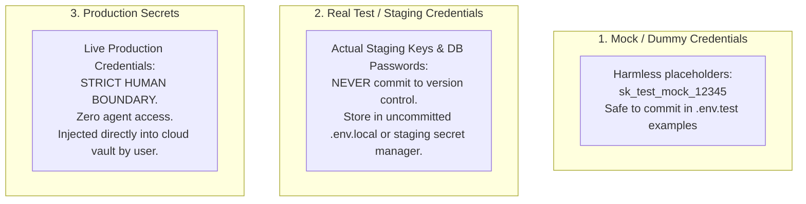

# Reference: Obsidian Integration, MCP & Telemetry

## 1. Vault Access: Primary & Fallback Mechanisms

The IT Department skill uses Markdown notes in `<project_root>/vault/` for live project telemetry, sprint tracking, and immutable decision logging.

### 1.1 Primary Interface: Standard Filesystem Tools
The coordinator and agents can directly inspect and update vault files using native file reading and writing tools (`view_file`, `replace_file_content`, `write_to_file`).
*   **Zero Dependencies:** Works out of the box on any system without extra server processes or network ports.
*   **Idempotent Updates:** Agents update YAML frontmatter or append markdown sections directly.

### 1.2 Optional Interface: Obsidian Model Context Protocol (MCP) Server
When an Obsidian MCP server is configured in the host environment, agents can interact with the vault via MCP tools (reading notes, appending content, querying frontmatter).

#### Generic, Portable MCP Configuration (`mcp_config.json`)
Do **not** hardcode machine-specific absolute paths (such as `C:\Users\...`). Instead, configure the server using environment variables or relative workspace paths supported by your MCP client:

```json
{
  "mcpServers": {
    "obsidian-vault": {
      "command": "npx",
      "args": [
        "-y",
        "mcp-obsidian",
        "${PROJECT_ROOT}/vault"
      ],
      "env": {
        "OBSIDIAN_VAULT_PATH": "${PROJECT_ROOT}/vault"
      }
    }
  }
}
```

*Note: If the MCP server fails to start, times out, or is unsupported, agents automatically fall back to direct filesystem operations.*

---

## 2. Dashboard Telemetry Maintenance

The file `<project_root>/vault/00-Dashboard.md` provides an executive overview of the project.

### Who Updates the Dashboard and When
The dashboard is generated, not hand-edited: the coordinator (the session holding `.it-department/lock.json`) runs `python3 <skill_root>/scripts/dashboard_sync.py --root <project_root>` at specific lifecycle transitions (`scripts/apply_transitions.py` runs it after applying transition requests) and at session end:
1.  **Task Assigned:** When a task moves to `In-Development`.
2.  **Task Ready for Release:** When QA marks `qa_status: passed`.
3.  **Defect Logged / Resolved:** When a bug is opened or closed in `vault/02-Bugs/`.
4.  **Production Release Completed:** When the release candidate commit SHA is deployed to production and tasks move to `vault/04-Archive/Completed-Tasks/`.
5.  **Report or Config Change:** When a usage audit, content review or QA report lands in `05-Reports/`, or `operating_profile` / `documents` change in `config.json`.

### Preventing Race Conditions
To prevent concurrent overwrite of the dashboard:
*   **One writer:** only the session holding `.it-department/lock.json` runs the sync and writes shared vault records; every other session works in contributor mode ([`workflows/session-protocol.md`](../workflows/session-protocol.md)).
*   **Deterministic and idempotent:** the dashboard is regenerated from the current contents of `vault/01-Tasks/`, `vault/02-Bugs/`, `vault/03-ADR/` and `vault/04-Archive/`, the reports and sidecars in `05-Reports/`, `config.json` and the lock file; two runs on the same state produce the same file.
*   **Marker blocks:** only the text between `<!-- sync:<name> start -->` and `<!-- sync:<name> end -->` is rewritten (`header`, `tokens`, `kanban`, `tasks`, `bugs`, `adr`, `usage-audits`, `content-reviews`, `releases`, `documents`); notes written outside the markers survive. A dashboard without markers gets the blocks inserted under the matching headings.
*   **Drift check:** `dashboard_sync.py --check` compares without writing (exit `0` current, `1` stale, with a short diff); `scripts/vault_lint.py` reports a stale dashboard as `VL012`. Run the check at session start before trusting the dashboard.

---

## 3. Automation vs. Coordinator-Driven Steps

To maintain operational integrity, we distinguish implemented automation from coordinator actions:

| Workflow Step | Actual Implementation Mechanism | Notes |
| :--- | :--- | :--- |
| **Branch CI Pipeline** | Coordinator runs local test commands (`npm test`, `dotnet test`, `pytest`) in the assigned worktree. | If host CI (e.g. GitHub Actions) is configured, coordinator inspects check status via git/CLI. |
| **Code Review Handoff** | Coordinator loads the reviewer persona and supplies the diff from the worktree. | Independent peer review must use separate context or subagents where available. |
| **QA Deployment** | Coordinator triggers test environment deploy script or runs docker compose in staging. | Does not fabricate test results; requires real test run execution. |
| **Dashboard Refresh** | `scripts/dashboard_sync.py` re-scans tasks, bugs, ADRs, archive, reports and config and rewrites the marker blocks of `00-Dashboard.md`. | Fully deterministic from file state; `--check` reports drift without writing. |
| **Transition Application** | `scripts/apply_transitions.py` validates and applies `transition-request.json` files (note move, frontmatter, Transition Log). | Refuses stale or illegal requests with a reason; `--dry-run` lists them. |
| **Vault Lint** | `scripts/vault_lint.py` (also run by `validate-project` when Python is available). | Frontmatter, ids, status vs folder, wikilinks, severity consistency, stale dashboard, expired lock. |

---

## 4. Secrets Security Boundary



*   **Mock Credentials:** Dummy strings used for offline unit testing. Safe to commit.
*   **Real Test Secrets:** Never commit real staging API keys or database passwords to git. Staging secrets must be treated with operational security and kept out of public or shared repositories.
*   **Production Secrets:** Strictly human-managed. Agents must never ask for, log, or persist production secrets.
