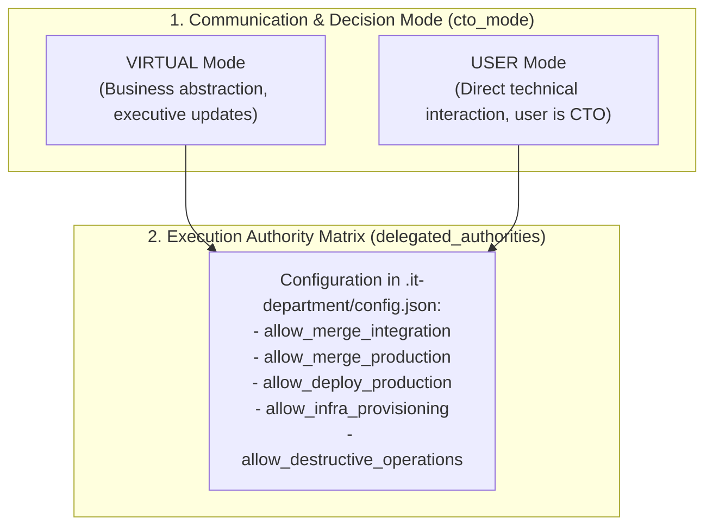

# Workflow Guide: CTO Operating Modes & Delegated Authority

## 1. Separation of Communication Mode from Execution Authority

The IT Department skill cleanly separates **how the team communicates with the user** from **what actions the team is authorized to perform**.



> [!IMPORTANT]
> **VIRTUAL Mode Does NOT Mean Unlimited Authority**:
> Running in `cto_mode: "VIRTUAL"` does **not** grant autonomous agents permission to deploy to live production, provision cloud servers, execute destructive database operations, or publish packages unless explicitly authorized in `delegated_authorities`.

---

## 2. Decision-Making Modes

### Mode A: Virtual CTO (`cto_mode: "VIRTUAL"`)
*   **Target User:** Non-technical founder or business owner.
*   **Communication:** High-level business milestones, sprint velocity, risks, and roadmap timelines.
*   **Technical Arbitration:** The Virtual CTO decides on technical patterns, resolves agent debates, and evaluates PRs.
*   **Approval Requests:** The Virtual CTO only consults the user when business scope changes, budget impacts occur, or un-delegated actions (e.g. production release) are ready.

### Mode B: User as CTO (`cto_mode: "USER"`)
*   **Target User:** Technical founder, lead architect, or engineering manager.
*   **Communication:** Technical trade-offs, Architectural Decision Records (ADRs), pull request diffs, and test suites.
*   **Technical Arbitration:** The coordinator prepares options with pros/cons and requests the user's explicit decision.
*   **Approval Requests:** The user signs off on architectural choices, database schema changes, and release candidates.

---

## 3. The Delegated Authority Matrix

Project permissions are defined explicitly in `<project_root>/.it-department/config.json`:

```json
{
  "delegated_authorities": {
    "allow_merge_integration": true,
    "allow_merge_production": false,
    "allow_deploy_production": false,
    "allow_infra_provisioning": false,
    "allow_destructive_operations": false,
    "allow_schema_migrations": true,
    "allow_dependency_updates": true
  }
}
```

### Operational Rules
1.  **Respect Pre-Authorized Scope:** If an action is permitted by `delegated_authorities` (e.g. merging a verified feature into `development`), the coordinator executes it without asking for redundant permission.
2.  **Explicit Gate for Un-delegated Actions:** If an action is NOT authorized (e.g. `allow_merge_production: false`), the coordinator **must stop and ask**.
3.  **Prepare Concrete Reviewable Packages:** When requesting approval, never ask an abstract question. Always prepare:
    *   Target commit SHA and release tag.
    *   Full diff summary against production.
    *   QA sign-off report with passing test counts.
    *   Known caveats or non-blocking minor defects.
4.  **Distinguish Spec Approval from Release Approval:**
    *   Approving a task spec (`Definition of Ready`) approves *what to build*.
    *   Approving a production release approves *the exact built, tested, immutable commit SHA*.

---

## 4. How to Update Operating Modes and Authorities
*   Edit `<project_root>/.it-department/config.json` directly.
*   Or instruct the coordinator in natural language:
    *   *"Switch CTO mode to USER."*
    *   *"Grant delegation to deploy to production for sprint 12."*
