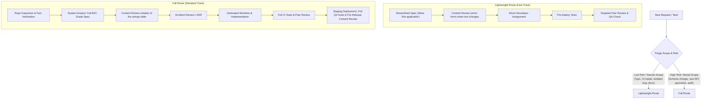

# Workflow Guide: Lightweight vs. Full Development Routes

## 1. Right-Sizing Engineering Overhead

Not every engineering change requires multi-role deliberation, schema migrations, and Architecture Decision Records. Imposing enterprise overhead on a one-line typo fix wastes time, while rushing a database migration risks data corruption.

The operating profile ([`operating-profiles.md`](./operating-profiles.md)) moves the boundary between the two routes: `prototype` sends everything down the lightweight route unless schema or auth is touched, `pilot` defaults to lightweight and keeps the full route for schema, auth, payments and data migration, and `production` triages as described below.

The IT Department skill defines two distinct delivery routes:

---

## 2. Route Comparison Matrix

| Aspect | Lightweight Route | Full Route |
| :--- | :--- | :--- |
| **Typical Changes** | Text/copy edits, CSS/UI tweaks, single-file bugfixes, internal utility updates, documentation. | New business features, multi-service integrations, database schema modifications, financial logic, public API additions. |
| **Operating Profile** | `prototype`: the default for everything that touches neither schema nor auth. `pilot`: the default route. `production`: the typical changes above. | `prototype`: only when schema or auth is touched. `pilot`: schema, auth, payments, data migration. `production`: the typical changes above. |
| **Analysis Phase** | Streamlined. Developer or analyst writes brief spec directly into `Ready-For-Dev`. | Comprehensive. Enters `In-Analysis`; passes formal Definition of Ready checklist. |
| **Database & API Spec** | Marked *"Not applicable"* if no tables or endpoints are touched. | Mandatory explicit tables, column types, SQL migrations, route tables, and JSON contracts. |
| **Content Review** | Short-form intake pass on the strings table whenever user-facing text changes (a copy edit *is* a content change); the pre-release review covers the change. | Mandatory intake review of §6 of the spec before `Ready-For-Dev`; pre-release review of every text of the candidate. Guide: [`content-review.md`](./content-review.md). |
| **Architect / ADR** | Skipped. | Mandatory review; ADR required for non-trivial technical trade-offs. |
| **Worktree** | Worktree recommended or isolated branch. | Dedicated worktree required (`.it-department/worktrees/<task-id>`). |
| **QA Verification** | Targeted verification of the specific change and immediate regression checks. | Full acceptance criteria test suite, edge cases, negative tests, and cross-service verification. |

---

## 3. Repository Inspection First: Facts vs. Assumptions

Before authoring a specification or assigning code modifications, agents must inspect the target project's actual repository.

Every task specification must clearly distinguish:
1.  **Verified Facts:**
    *   Existing files, class names, route controllers, and database contexts confirmed via `view_file` or `grep_search`.
2.  **Proposed New Artifacts:**
    *   Files, endpoints, or migrations to be created.
3.  **Assumptions:**
    *   Working assumptions (e.g., specific framework conventions, database engine versions).
4.  **Unresolved Questions:**
    *   Ambiguities that must be resolved with the user or domain expert before implementation begins.

---

## 4. Respecting Existing Project Conventions

The IT Department skill adapts to the project, not the other way around:
*   **Branch Names:** If the target repository uses `main` instead of `production`, or `develop` instead of `development`, configure these in `<project_root>/.it-department/config.json`. Never rename or force foreign branch names on an existing repository.
*   **Linters & Test Runners:** Respect the project's native build tools (`cargo test`, `pytest`, `npm test`, `dotnet test`, `mvn test`). Do not impose unconfigured tooling.
*   **Coding Conventions:** Adopt the existing style, naming conventions, and file directory layout found in the codebase.
*   **Localization Mechanism:** Use the project's existing resource system (`.resx`, i18n JSON, Android `strings.xml`, code tables) for every user-facing string; configure its locations in `content_review.text_sources` / `inline_tables` so the content inventory sees them.
