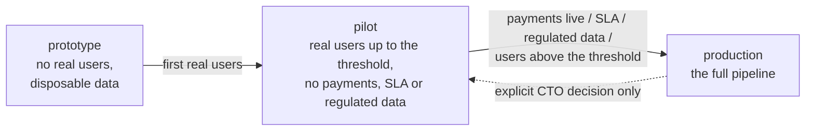

# Workflow Guide: Operating Profiles (Right-Sizing the Process)

**Five users is not an SLA.** A product in its first weeks, used by a handful of people who know the team,
does not need a staging cluster, a frozen release candidate, a full regression suite per change and a formal
release board: those gates protect users and revenue that do not exist yet, and they cost exactly the speed
the product needs most. A product with live payments, promised uptime or regulated data needs every one of
them. The **operating profile** makes this judgement explicit instead of leaving it to each session: one value
in `config.json`, owned by the CTO, sets the depth of every gate. In the early profiles "back up the database
and work directly in production" is a legitimate, documented path (a named backup, a smoke test, a 15-minute
watch and a known way back), not a shortcut taken quietly. What never moves with the profile are the floors
in section 3.



---

## 1. Configuration

```json
"operating_profile": "pilot",
"profile_review": {
  "active_users": 0,
  "payments_live": false,
  "sla_promised": false,
  "regulated_data": false,
  "reviewed_at": "{YYYY-MM-DD}",
  "note": "Why this profile; what would trigger the next one"
}
```

*   `operating_profile` — `prototype`, `pilot` or `production`. **Absent = `production`**: projects created
    before profiles existed keep the full pipeline until the CTO chooses otherwise (`init-project` never
    injects keys into an existing config).
*   New projects get `pilot` from [`assets/config-template.json`](../assets/config-template.json). That value
    is a proposal, not a decision: the coordinator confirms it in the first session (section 4.1).
*   `profile_review` — the facts the criteria are checked against. They are business facts, so the coordinator
    asks the user instead of guessing them from the repository. `reviewed_at` is the date of the last check;
    `note` says why this profile applies and what would trigger the next one, including the pilot user
    threshold when the CTO sets one other than the default 50 active users.
*   The dashboard header shows the active profile with a link to the decisions journal (generated by
    `scripts/dashboard_sync.py`); `validate-project` checks the value and warns when it is absent.

---

## 2. Profile matrix (normative)

| Gate / rule | `prototype` | `pilot` | `production` |
| :--- | :--- | :--- | :--- |
| **Criteria** (any criterion of a later column moves the project up) | no real users; data can be thrown away | real users ≤ the CTO's pilot threshold (default 50 active), no live payments, no SLA, no regulated data | live payments **or** SLA promised **or** regulated data **or** users above the pilot threshold |
| **Route sizing** | everything lightweight unless schema or auth is touched | lightweight by default; full route for schema, auth, payments, data migration | as today ([`lightweight-vs-full-routes.md`](./lightweight-vs-full-routes.md)) |
| **Definition of Ready depth** | context + acceptance criteria + content table | full template; DB/API sections may be "Not applicable" with one sentence why | full template |
| **Architect / ADR** | on CTO request only | for schema, auth, payments, integrations | as today (non-trivial trade-offs) |
| **Peer code review** | optional; the coordinator reads the diff | required for full-route tasks; lightweight = coordinator diff read | required |
| **Test coverage gate** | tests for the changed logic; threshold not enforced | threshold enforced on changed projects | threshold enforced on all |
| **Staging / test environment** | not required | not required; prod with backup may serve as test env | required |
| **QA scope on a candidate** | smoke path of the changed feature | fixed defects + one smoke path per feature; full suite once before the first wide release, after that once per candidate SHA that touches shared flows | full suite once per candidate SHA (R3) |
| **Content review** | Checkpoint B only on strings changed since baseline; Checkpoint A short form | both checkpoints; short form allowed for lightweight tasks | both checkpoints as specified |
| **Deploy to production** | directly from the integration branch after smoke, **DB backup first** | after QA smoke + content verdict, **DB backup first**; rollback = restore backup or redeploy previous artifact; 15-minute watch | immutable candidate SHA, CTO gate, full rollback plan |
| **"Experiment in prod"** | allowed: backup → change → smoke → watch 15 min → keep or restore | allowed for changes reversible by restore or redeploy; announce to users only if visible downtime > 5 min | not allowed; use staging |
| **Hotfix** | commit on integration, deploy, backfill task note | same + QA smoke | [`review-qa-and-release.md`](./review-qa-and-release.md) §3.2 |
| **Usage audit** | same cadence; proposals may be applied by the coordinator without a decision note when they only change tool defaults | same | as today |

*   "As today" means the behavior the rest of this skill describes; `production` is the pipeline of
    [`SKILL.md`](../SKILL.md) section 7 unchanged.
*   Gate details stay where they were: routes in [`lightweight-vs-full-routes.md`](./lightweight-vs-full-routes.md),
    the Definition of Ready item by item in [`references/definition-of-ready-done.md`](../references/definition-of-ready-done.md),
    review, QA, deploy and hotfix in [`review-qa-and-release.md`](./review-qa-and-release.md), content checkpoints in
    [`content-review.md`](./content-review.md), the audit in [`efficiency-and-usage-audit.md`](./efficiency-and-usage-audit.md).
*   *Threshold* is `quality_gates.test_coverage_threshold_percent`; *changed projects* are the modules or test
    projects the change touches.
*   *Short form* (content review): the same checks on the strings in scope (every locale, placeholders,
    glossary), recorded as a verdict and a findings list instead of the full report template.
*   *Usage audit in `prototype` / `pilot`:* a proposal applied without a decision note still gets its `Decision`
    cell filled in the audit report (`applied: tool default`); otherwise the dashboard keeps counting it as pending.

---

## 3. Floors that no profile relaxes

*   Secrets never in git ([`secrets-and-incidents.md`](./secrets-and-incidents.md)).
*   A **verified backup** before any destructive operation, migration or production experiment: a named,
    restorable artifact (DB dump, volume snapshot, export) whose existence and size were checked and whose
    restore command is written next to its name.
*   No force-push, no history rewrite on shared branches.
*   Archive instead of delete in the vault.
*   `delegated_authorities` always apply: a profile never grants authority ([`cto-and-authority.md`](./cto-and-authority.md) §3).
*   The Stubborn Donkey gate stays ([`deep-reasoning-and-override.md`](./deep-reasoning-and-override.md)).
*   The usage ledger export stays ([`efficiency-and-usage-audit.md`](./efficiency-and-usage-audit.md) §3).

---

## 4. Rules

### 4.1 The CTO owns the profile
*   The coordinator **proposes** the profile at project init and whenever a `profile_review` fact changes
    (payments go live, an SLA is promised, regulated data arrives, users pass the threshold): it shows the facts
    and the matrix column they imply and **asks for confirmation once**. It never switches silently.
*   The decision is a row in the decisions journal `<vault>/03-ADR/decisions-log.md` (`D-NNN`, format in
    [`templates/decision-record.md`](../templates/decision-record.md)), for example
    `D-001 | 2026-10-07 | Operating profile | pilot: 5 active users, no payments, no SLA | CTO | [[00-Dashboard]] | review at 50 users or when payments go live`.
*   In `cto_mode: "VIRTUAL"` the Virtual CTO confirms upgrades and reports them to the Business Owner in
    business terms. A **downgrade** lowers the protection of real users, so it needs the user's explicit
    decision in both modes.

### 4.2 The profile in every brief and gate
*   Every Task Assignment Contract carries the field
    ([`orchestration-and-worktrees.md`](./orchestration-and-worktrees.md) §2)
    `Profile & Gates: {operating_profile}: {route}, review {required|coordinator}, QA {smoke|targeted|full}, deploy {direct+backup|candidate gate}`,
    for example `pilot: lightweight, review coordinator, QA smoke, deploy direct+backup`,
    `pilot: full, review required, QA targeted, deploy direct+backup` (a schema change in a pilot) or
    `production: full, review required, QA full, deploy candidate gate`.
*   Every release gate message names the profile and the gates that were applied, so the CTO approves a known
    depth, not an assumed one.

### 4.3 Re-check at every release gate
*   At each release gate the coordinator re-checks the criteria against `profile_review` (asking about any fact
    that may have changed), updates `reviewed_at`, and proposes an **upgrade** when a criterion of the next
    column is met. **Downgrades** happen only on explicit CTO decision (section 4.1).
*   A release that itself makes a criterion true (the release that switches payments on, opens sign-up to
    everyone or starts storing regulated data) already goes through the gates of the higher profile.
*   After a switch, tasks in flight are re-briefed at their next transition; the next release uses the new gates.

### 4.4 "Experiment in prod" (`prototype`, `pilot`)
1.  **Backup** with a named, restorable artifact (DB dump, volume snapshot, export) and record its name in the
    session note.
2.  **Apply** the change.
3.  **Smoke** the changed flow.
4.  **Watch** logs and health for 15 minutes.
5.  **Keep** (backfill the task note and its transition) **or roll back** (restore the backup or redeploy the
    previous artifact).
6.  **Record** the outcome in the decisions journal when it changed product behavior.

*   Every step still needs its authority: a deploy needs `allow_deploy_production` (or the user's go-ahead), a
    schema change `allow_schema_migrations`, a restore `allow_destructive_operations` (or the user's go-ahead),
    because a restore overwrites production data.
*   A restore loses every write made after the backup. With real users (`pilot`) prefer redeploying the previous
    artifact when the data is intact and restore only when the change damaged the data. `pilot` allows only
    changes that a restore or redeploy can reverse, and announces them to users only when the visible downtime
    exceeds 5 minutes.
*   `production`: not allowed; use staging.

---

## 5. Switching profiles

1.  **Config:** set `operating_profile` in `.it-department/config.json`; update the `profile_review` facts,
    `reviewed_at` (today) and `note` (why, and what triggers the next switch).
2.  **Decisions journal:** add the `D-NNN` row (from → to, the facts, who decided, the review trigger).
3.  **Dashboard:** run `scripts/dashboard_sync.py`; the header shows the new profile with a link to the journal.
4.  **Validate:** `validate-project` checks the value and the `profile_review` types.
5.  **Brief:** from the next Task Assignment Contract on, `Profile & Gates` names the new profile.

---

## 6. Examples

### 6.1 A `pilot` project ships a copy fix
`Profile & Gates: pilot: lightweight, review coordinator, QA smoke, deploy direct+backup`
1.  **Spec and intake.** The analyst writes a lightweight note directly into `Ready-For-Dev` with the current
    and the new text in every locale (template §6); the Content Reviewer approves the wording in short form
    (`content_review_intake: approved`).
2.  **Change.** The developer copies the approved strings into the resource files in a worktree and runs
    `content_inventory.py` (no findings for the changed keys); the coordinator reads the diff (no separate peer
    review for a lightweight task) and merges into the integration branch.
3.  **Check.** QA runs the smoke path of the changed screen in every locale; the Content Reviewer confirms the
    changed strings (Checkpoint B, short form) and gives the verdict.
4.  **Deploy.** DB backup first, its name recorded in the session note (`backup-2026-10-07-0930.dump`); deploy
    the integration build with `allow_deploy_production` or the user's go-ahead; watch for 15 minutes. Way back:
    redeploy the previous artifact (the data was not touched, so no restore).
5.  **Close.** Transition requests are applied with `apply_transitions.py` (archived with `release_version` and
    `release_commit`), `dashboard_sync.py` refreshes the dashboard, every session exports its usage.

### 6.2 A `production` project ships a payment change
`Profile & Gates: production: full, review required, QA full, deploy candidate gate`
1.  **Full route.** `In-Analysis` and the full Definition of Ready: schema and migration with a rollback or
    forward-fix script, endpoints, JSON contracts, the strings table, feasibility ≥ 8
    ([`references/definition-of-ready-done.md`](../references/definition-of-ready-done.md)).
2.  **Architect and ADR** for the trade-offs (provider, idempotency, refunds); content Checkpoint A on the
    payment texts.
3.  **Build.** Dedicated worktree, coverage threshold on all projects, CI, mandatory peer review, merge into the
    integration branch, deploy to staging.
4.  **Verify the candidate.** Freeze the candidate SHA, inspect the complete production diff, run the full suite
    once (R3) and content Checkpoint B on the same SHA; take a verified backup before the migration (floor).
5.  **Release.** CTO gate on the immutable SHA with QA and content verdicts and the full rollback plan; deploy
    under `allow_deploy_production` or the user's go-ahead; 15-minute watch; rollback = redeploy the previous
    artifact plus the migration mitigation. No experiment in production.
6.  **Close.** Archive with the release tag; the dashboard is regenerated.
