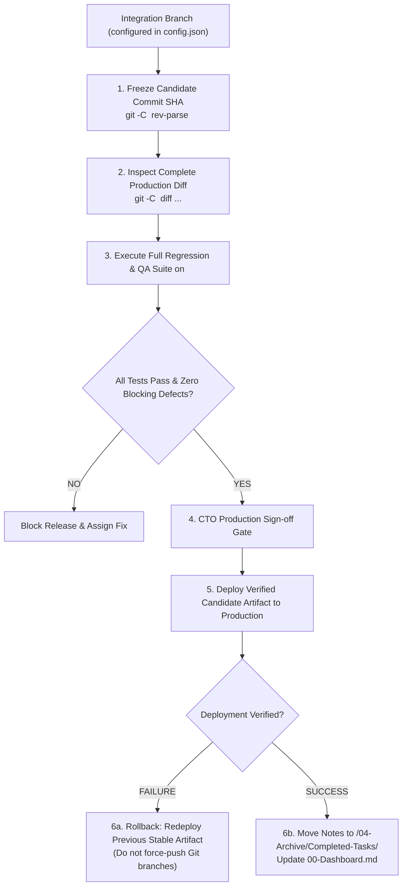

# Workflow Guide: Review, QA Verification & Immutable Release Management

## 1. The Principle of the Immutable Release Candidate

A software release cannot be approved simply because individual sprint tickets are marked "Ready." Software systems fail at integration boundaries when multiple changes interact unexpectedly.

> [!IMPORTANT]
> **Release Verification Governs the Commit SHA, Not the Sprint Plan**:
> Release verification, QA sign-off, and CTO approval apply strictly to an **immutable commit SHA** (the Release Candidate), representing the **complete production diff** against the production baseline, including any commits pushed outside the sprint plan.



---

## 2. Release Candidate Verification Step-by-Step

All branch names are resolved from `<project_root>/.it-department/config.json`:
*   `$PROD_BRANCH = $config.git_policy.production_branch`
*   `$INT_BRANCH = $config.git_policy.integration_branch`

### Step 1: Identify Repository & Freeze Candidate Commit SHA
Resolve candidate from the target repository and the configured integration ref:
```bash
RELEASE_CANDIDATE_SHA=$(git -C "<repository_root>" rev-parse "$INT_BRANCH")
PRODUCTION_BASELINE_SHA=$(git -C "<repository_root>" rev-parse "$PROD_BRANCH")
echo "Production Baseline SHA: $PRODUCTION_BASELINE_SHA"
echo "Release Candidate SHA:   $RELEASE_CANDIDATE_SHA"
```

### Step 2: Audit Complete Production Diff
Inspect all commits and file diffs between the production baseline and candidate SHA:
```bash
git -C "<repository_root>" log --oneline "$PRODUCTION_BASELINE_SHA..$RELEASE_CANDIDATE_SHA"
git -C "<repository_root>" diff --stat "$PRODUCTION_BASELINE_SHA...$RELEASE_CANDIDATE_SHA"
```
*Audit Check:* Verify that every change in this diff is accounted for. Check for unintended commits or configuration changes.

### Step 3: Attach Evidence to Candidate SHA
QA test results, security scan outputs, and reviewer approvals are recorded against the exact candidate SHA:
*   `Test Execution: PASS (Candidate: $RELEASE_CANDIDATE_SHA, Tests: 184 passed, 0 failed)`
*   `Defect Audit: PASS (0 Critical, 0 Major defects open)`

*Efficiency rule R3 (targeted re-verification):* the full regression and scenario suite runs **once per candidate SHA**. After a fix round QA re-verifies only the fixed defects plus one smoke path; a new full run is owed only when the candidate SHA changes (Step 4). Screenshot evidence follows the R2 budget (see [`efficiency-and-usage-audit.md`](./efficiency-and-usage-audit.md)).

### Step 4: The Candidate Invalidation Rule
*   The frozen candidate SHA remains valid for testing even if newer, unrelated commits arrive on `$INT_BRANCH`.
*   **Revalidation is triggered only when:**
    1. The selected release candidate SHA changes (e.g. a bugfix commit is added to the candidate).
    2. The production baseline SHA changes (e.g. an emergency hotfix was deployed).
    3. Build, environment, or dependency inputs affecting the release artifact change.

### Step 5: Production Deployment
Once authorized in accordance with `delegated_authorities` and CTO sign-off:
1.  Deploy the built artifact corresponding to `$RELEASE_CANDIDATE_SHA` using the project's deployment mechanism (e.g. CI/CD deploy pipeline, container release).
2.  Update the production branch ref in Git cleanly via fast-forward merge or release tag:
    ```bash
    git -C "<repository_root>" checkout "$PROD_BRANCH"
    git -C "<repository_root>" merge --ff-only "$RELEASE_CANDIDATE_SHA"
    git -C "<repository_root>" tag -a "vX.Y.Z" -m "Release vX.Y.Z (SHA: $RELEASE_CANDIDATE_SHA)"
    ```
3.  Monitor production health and error metrics for 15 minutes post-deployment.

### Step 6: Post-Deploy Archival
Only **after** deployment success is verified:
1.  The coordinator moves notes from `<vault>/01-Tasks/Ready-For-Release/` to `<vault>/04-Archive/Completed-Tasks/`.
2.  Update task frontmatter:
    ```yaml
    status: Archived
    release_version: "vX.Y.Z"
    release_commit: "$RELEASE_CANDIDATE_SHA"
    archived_at: "2026-09-10T17:30:00Z"
    ```
3.  The coordinator regenerates `<vault>/00-Dashboard.md`.

---

## 3. Non-Destructive Rollback & Hotfix Protocols

### 3.1 Non-Destructive Rollback Procedure
If a production deployment fails or causes severe regressions:

> [!CAUTION]
> **Never Force-Push or Hard-Reset Git Branches During an Outage**:
> Changing a git branch pointer does not roll back a live deployment and destroys shared history.

1.  **Operational Artifact Rollback:**
    *   Immediately re-deploy the previous known healthy artifact / container / package tag through the project's deployment system.
2.  **Database Migration Compatibility:**
    *   Do **not** assume rolling back the application container undoes database migrations.
    *   If the migration was backwards-compatible, leave it in place.
    *   If the migration caused the failure, execute the task's pre-planned database mitigation script or prepare a forward fix.
3.  **Source Code Synchronization:**
    *   After the live deployment is stabilized, correct the repository history non-destructively by opening a revert pull request:
    ```bash
    git -C "<repository_root>" revert -m 1 "$RELEASE_CANDIDATE_SHA"
    ```
    *   Merge the revert PR through the normal protected review process.
4.  **Escalation when Rollback is Unsupported:**
    *   If the project has no automated rollback mechanism, the coordinator immediately records a blocker note and escalates to the CTO and human user with a concrete incident summary.

### 3.2 Emergency Production Hotfix Flow
When a critical vulnerability or production crash requires an immediate patch:
1.  **Worktree from Production:**
    ```bash
    git -C "<repository_root>" worktree add -b "hotfix/{task-id}/{dd.mm.yyyy}/dev-backend" \
      "<project_root>/.it-department/worktrees/{task-id}" "$PROD_BRANCH"
    ```
2.  **Implement & Verify:** Write minimal patch in the worktree. Run pre-deploy tests.
3.  **Deploy Hotfix:** Deploy verified artifact and fast-forward `$PROD_BRANCH`.
4.  **Mandatory Synchronization Back to Integration:**
    *   To prevent regression in the next regular release, the hotfix commit must be synchronized back into `$INT_BRANCH` via a standard pull request:
    ```bash
    git -C "<repository_root>" checkout "$INT_BRANCH"
    git -C "<repository_root>" merge "$PROD_BRANCH"
    ```
